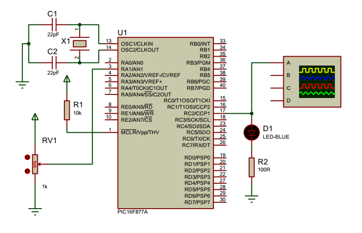

## ADC - Analog to Digital Conversion

<p align="center">
      
</p>

The Analog-to-Digital (A/D) Converter module has five inputs for the 28-pin devices and eight for the 40/44-pin devices. The conversion of an analog input signal results in a corresponding `10-bit` digital number. The A/D module has high and low-voltage `reference input` that is software selectable to some combination of VDD, VSS, RA2 or RA3. The A/D converter has a unique feature of being able to operate while the device is in Sleep mode. To operate in Sleep, the A/D clock must be derived from the A/D’s internal RC oscillator.

**The A/D module has four registers. These registers are:**
- A/D Result High Register `(ADRESH)`
- A/D Result Low Register `(ADRESL)`
- A/D Control Register 0 `(ADCON0)`
- A/D Control Register 1 `(ADCON1)`

**Steps in A/D Conversion**
- Configure `ADCON0` register to set the clock frequency, set up channels and powering up the A/D module.
```c
      ADCON0bits.ADCS = 0b00; // set A/D conversion clock = fosc/2
      ADCON0bits.CHS = 0b000; // set all adc channels off
      ADCON0bits.ADON = 0; // a/d module is powered off
```
- Configure `ADCON1` to set the justification of 10bit output (Ouptut is stored in both `ADRESH` and `ADRESL`), clock frequency and data direction of analog input pins.
```c
      ADCON1bits.ADFM = 1; // set right justification for ADRESH
      ADCON1bits.ADCS2 = 0; // set A/D conversion clock = fosc/2
      ADCON1bits.PCFG = 0b0000; // set all pins as adc input 
```
- Read analog input value
```c
      int __adc_read(int adc_channel) {
          ADCON0bits.ADON = 1; // turn on a/d module
          ADCON0bits.CHS = adc_channel; // turn on adc channel
          __delay_ms(10); // wait for capacitors to charge up
          ADCON0bits.GO = 1; // begin conversion
          while(ADCON0bits.GO_DONE == 1) {
              // wait for conversion to finish
          }
          int adc_value = (ADRESH << 8) + (ADRESL);
          return adc_value;
      }
```
 
### Circuit Diagram

<p align="center">
      
</p>

## License
[](https://creativecommons.org/licenses/by-nc-sa/4.0)

This work is licensed under [GNU General Public License v3.0](https://github.com/atick-faisal/PIC16F877a/blob/master/LICENSE).
