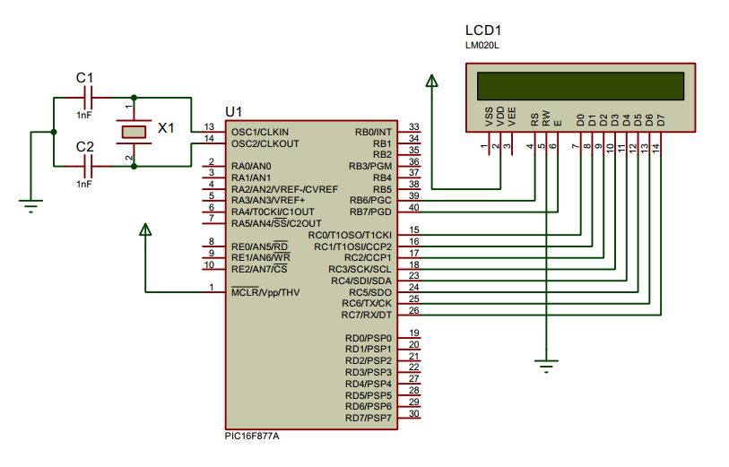

## LCD Display Control

<p align="center">
  
</p>

LCD (Liquid Crystal Display) screen is an electronic display module and find a wide range of applications. A `16x2` LCD display is very basic module and is very commonly used in various devices and circuits. These modules are preferred over seven segments and other multi segment LEDs. The reasons being: LCDs are economical; easily programmable; have no limitation of displaying special & even custom characters (unlike in seven segments), animations and so on.

### 1. Initialize the Display
- Turn on Display by writing 1 to `DB3`
- Set display by writting 1 to `DB2`
- Turn on cursor by setting `DB1` bit
- Turn on blinking cursor by writting to `DB0`

  ```c
        DATA_PORT = 0b00001111;
  ```
  
### 2. Clear the display
- Set the `DB0` bit to clear display

  ```c
      DATA_PORT = 0b00000001;
  ```
  
### 3. Writing character to the display
- Set register select `RS` pin high
- Put the character in data port

  ```c
      SETUP_PORT |= (1 << RS);
      DATA_PORT = character_ascii_value;
  ```
  
### 4. Writting a String
- Call `lcd_write_char` function looping through the string

  ```c
      void lcd_write(char data[]) {
        int i;
        for(i=0; i<(strlen(data)); i++) {
            lcd_write_char(data[i]);
        }
      }
  ```
  
### 5. Writting any changes to display
- Set `EN` pin
- write values to `RS` or `DATA_PORT`
- wait for a while
- clear `EN` pin

### Circuit Diagram

<p align="center">
  
</p>

## License
[](https://creativecommons.org/licenses/by-nc-sa/4.0)

This work is licensed under [GNU General Public License v3.0](https://github.com/atick-faisal/PIC16F877a/blob/master/LICENSE).
