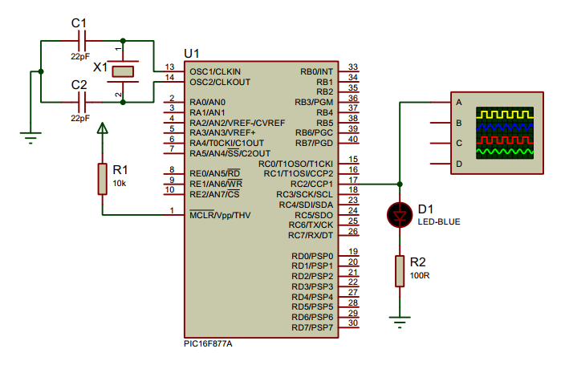

## PWM - LED Brightness Control

<p align="center">
  
</p>

Pulse Width Modulation `(PWM)` is a digital signal which is most commonly used in control circuitry. This signal is set high (5v) and low (0v) in a predefined time and speed. The time during which the signal stays high is called the “on time” and the time during which the signal stays low is called the “off time”.

**Duty Cycle of PWM**

The percentage of time in which the PWM signal remains HIGH (on time) is called as duty cycle. If the signal is always ON it is in 100% duty cycle and if it is always off it is 0% duty cycle.

  `Duty Cycle =Turn ON time/ (Turn ON time + Turn OFF time)`


**Frequency of PWM**

The frequency of a PWM signal determines how fast a PWM completes one period. One Period is complete ON and OFF of a PWM signal as shown in the above figure.

### Setting Up PWM signal
- PWM signals can be generated in our PIC Microcontroller by using the CCP (Compare Capture PWM) module. The resolution of our PWM signal is 10-bit, that is for a value of 0  there will be a duty cycle of 0% and for a value of 1024 (2^10) there be a duty cycle of 100%. There are two CCP modules in our PIC MCU (CCP1 And CCP2), this means we can generate two PWM signals on two different pins (pin 17 and 16) simultaneously, in our tutorial we are using CCP1 to generate PWM signals on pin 17.

**1. Required Registers**

- `CCP1CON`  (CCP1 control Register)
- `T2CON` (Timer 2 Control Register)
- `PR2`  (Timer 2 modules Period Register)
- `CCPR1L` (CCP Register 1 Low)

**2. Set up PWM2 module**

- `T2CON` Register:

 |   7   |   6   |   5   |   4   |   3   |   2   |   1   |   0   |
 |-------|-------|-------|-------|-------|-------|-------|-------|
 |   -   |TOUTPS3|TOUTPS2|TOUTPS1|TOUTPS0|TMR2ON |T2CKPS1|T2CKPS0|
 
```c
    void __init_pwm() {
      TRISCbits.TRISC2 = 0; // set RC2 as output
      T2CONbits.TMR2ON = 1; // set timer 2 on
      T2CONbits.T2CKPS = 0b10; // set pre scalar of 16
      CCP1CONbits.CCP1M = 0b1100; // set PWM mode of operation
    }
```

**3. Set PWM Period**

- Set the PWM period by writing to the `PR2` register.

- `PWM Period = [(PR2) + 1] • 4 • TOSC •(TMR2 Prescale Value)`

```c
    void __set_pwm_freq(int f) {
      PWM_FREQ = f;
      PWM_PERIOD = 1 / PWM_FREQ;
      int PR2_value = ((PWM_PERIOD * _XTAL_FREQ) / (4 * PRESCALAR) - 1);
      PR2 = PR2_value;
    
    }
```

**4. Set Duty Cycle**

- Set the PWM duty cycle by writing to the `CCPR1L` register and `CCP1CON<5:4>` bits.
- `PWM Duty Cycle =(CCPR1L:CCP1CON<5:4>) •TOSC • (TMR2 Prescale Value)`

```c
    void __set_duty_cycle(int duty_cycle) {
      float dc = (float) duty_cycle / 100;
      float dc_period = dc * PWM_PERIOD; 
      int reg_value = (int) ((dc_period * _XTAL_FREQ) / PRESCALAR);
      /*
       * PWM has 10 bit resolution
       * 8 bits of MSB is stored in CCPR1L
       * 2 bits of LSB is stored in CCP1CON(5:4)
       */
      CCPR1L = reg_value >> 2; 
      CCP1CONbits.CCP1X = (reg_value & 0b00000001);
      CCP1CONbits.CCP1Y = (reg_value & 0b00000010);
    }
```

### Circuit Diagram

<p align="center">
   
</p>

## License
[](https://creativecommons.org/licenses/by-nc-sa/4.0)

This work is licensed under [GNU General Public License v3.0](https://github.com/atick-faisal/PIC16F877a/blob/master/LICENSE).
