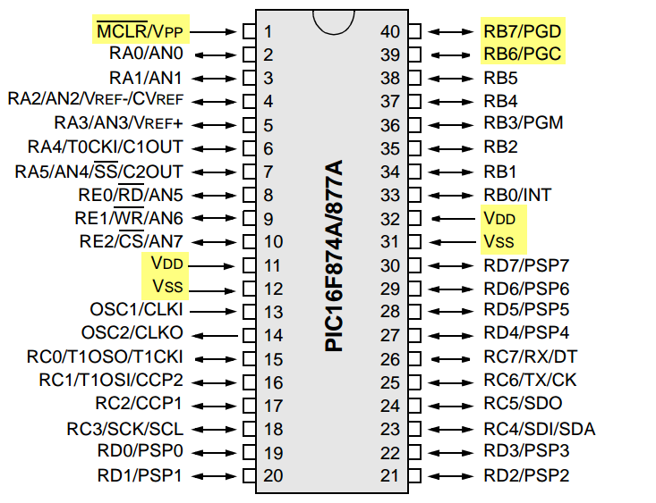

# PIC16F877a
## pic16f877a mini projects using mplab x ide and xc8 compiler 
 
<ul>
<li><h3>MPLABX IDE installation: </h3>
<a href"http://microchipdeveloper.com/mplabx:installation"> <b>Click Here to Install MPLAB® X IDE</b></a></li>
  <li><h3>XC8 Compiler installation: </h3>
<a href"http://microchipdeveloper.com/xc8:installation"> <b>Click Here to Install MPLAB® X IDE</b></a></li>
<li><h3>PIC16F877a Pinout : </h3>
  </li>
<li><h3>PicKit3 Pinout : </h3>
</li>
  </ul>
