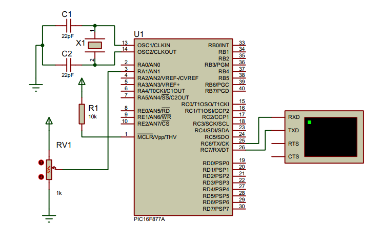

## USART - Serial Communication

<p align="center">

</p>

The Universal Synchronous Asynchronous Receiver Transmitter `(USART)` module is one of the two serial I/O modules. (USART is also known as a Serial Communications Interface or `SCI`.) The USART can be configured as a full-duplex asynchronous system that can communicate with peripheral devices, such as CRT terminals and personal computers, or it can be configured as a half-duplex synchronous system that can communicate with peripheral devices, such as A/D or D/A integrated circuits, serial EEPROMs, etc.

The USART can be configured in the following modes:
- Asynchronous (full-duplex)
- Synchronous – Master (half-duplex)
- Synchronous – Slave (half-duplex)

### Setting Up USART
**1. Associated Registers**
- `TXSTA` Register:

  |   7   |   6   |   5   |   4   |   3   |   2   |   1   |   0   |
  |-------|-------|-------|-------|-------|-------|-------|-------|
  |  CSRC |  TX9  |  TXEN | SYNC  |   -   |  BRGH | TRMT  |  TX9D |
     
- `RCSTA` Register:

  |   7   |   6   |   5   |   4   |   3   |   2   |   1   |   0   |
  |-------|-------|-------|-------|-------|-------|-------|-------|
  |  SPEN  |  RX9    |  SREN  | CREN  |   ADDEN    |  FERR  | OERR    |  RX9D  |  
  
**2. Configure `USART` module**

- Set up `TXSTA` register

  ```c
      TXSTAbits.TX9 = 0; // set 8 bit transmission
      TXSTAbits.TXEN = 1; // enable data transmit
      TXSTAbits.SYNC = 0; // select asynchronous mode
      TXSTAbits.BRGH = 1; // set high baud rate
  ```

- Set up `RCSTA` register

  ```c
      RCSTAbits.SPEN = 1; // enable serial ports
      RCSTAbits.RX9 = 0; // select 8 bit reception
      RCSTAbits.CREN = 1; // enable continuous receive
  ```

#### 3. Set the `BAUD RATE` of communication:

- `Baud Rate = FOSC/(16 (SPBRG + 1))`

  ```c
      void __set_baud_rate(int baud_rate) {
        SPBRG = ((_XTAL_FREQ / 16) / baud_rate) - 1;
      }
  ```
  
#### 4. Writing a character

- Wait for the previous transmission to complete. When it is completed the `TXIF` bit is set.
- Write the character in `TXREG`

  ```c
      void __write_char(char c) {
          while(!TXIF) {
              // wait until byte is sent
          } 
          TXREG = c; // transmit a bit
      }
  ```
  
#### 5. Writting a String

- Call the `__write_char(c)` function everytime looping through the string.

  ```c
      void __usart_write_ln(char data[]) {
          int i;
          for(i=0; i<(strlen(data)); i++) {
              __write_char(data[i]);
          }
          __write_char('\r');
      }
  ```

### Circuit Diagram

<p align="center">

</p>

## License
[](https://creativecommons.org/licenses/by-nc-sa/4.0)

This work is licensed under [GNU General Public License v3.0](https://github.com/atick-faisal/PIC16F877a/blob/master/LICENSE).
