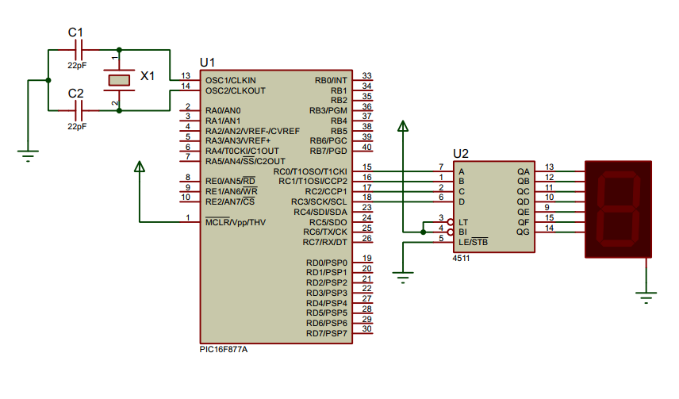

## Seven Segment Display

<p align="center">
  
</p>

### BCD to Sven Segment Decoder

<p align="center">
  
</p>

### Truth Table

<p align="center">
  
</p>

### Writing to the Decoder
- Loop through `0-9` and write the binary value to the `PORT`

  ```c
      void display() {
          int i;
          for(i=0; i<10; i++) {
              PORTC = i;
              __delay_ms(1000);
          }
      }
  ```

### Circuit Diagram

<p align="center">

  </p>

## License
[](https://creativecommons.org/licenses/by-nc-sa/4.0)

This work is licensed under [GNU General Public License v3.0](https://github.com/atick-faisal/PIC16F877a/blob/master/LICENSE).
