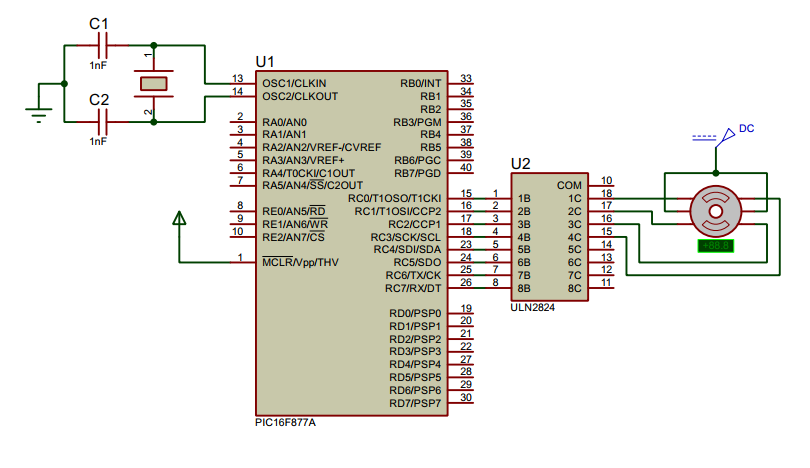

## Stepper motor control

<p align="center">
  
</p>

Stepper motors vary from regular DC motors in that, rather than just spinning in one direction or another, they can spin in very precise increments.

### Basic Operation
<p align="center">
  
</p>

### Bit Writting Sequence
-
  |A|B|C|D|Angle|
  |-|-|-|-|-|
  |0|0|0|1|0|
  |0|0|1|1|45|
  |0|0|1|0|90|
  |0|1|1|0|135|
  |0|1|0|0|180|
  |1|1|0|0|225|
  |1|0|0|0|270|
  |1|0|0|1|315|
  
- write values to connected `PORT`
  
  ```c
  void rotate_motor() {
      PORTC = 0b00000001;
      __delay_ms(40);
      PORTC = 0b00000011;
      __delay_ms(40);
      PORTC = 0b00000010;
      __delay_ms(40);
      PORTC = 0b00000110;
      __delay_ms(40);
      PORTC = 0b00000100;
      __delay_ms(40);
      PORTC = 0b00001100;
      __delay_ms(40);
      PORTC = 0b00001000;
      __delay_ms(40);
  }
  ```

### Circuit Diagram

<p align="center">

  </p>

## License
[](https://creativecommons.org/licenses/by-nc-sa/4.0)

This work is licensed under [GNU General Public License v3.0](https://github.com/atick-faisal/PIC16F877a/blob/master/LICENSE).
