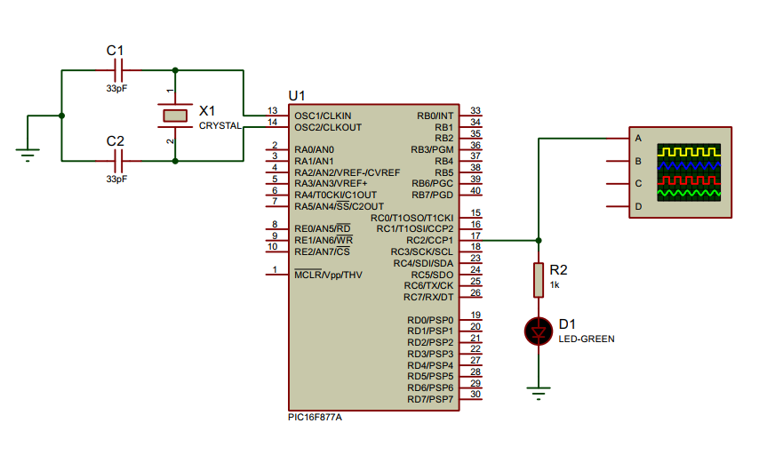

## Creating 1Hz pulse using `PIC` internal timer interrupt

<p align="center">
  
  </p>
  
pic16f877a has 3 timers. they are:
- Timer0 (8 bit)
- Timer1 (16 bit)
- Timer2 (8bit)

### 1. Setting Up Timer1 `OPTION_REG` register
- Set `prescale` of 8

  ```c
      T1CKPS0 = 1;
      T1CKPS1 = 1;
  ```
- Enable Timer1

  ```c
      TMR1ON = 1;
  ```
  
### 2. Set up the Interrupt `INTCON` register
- Enable Global an Peripheral interrupt

  ```c
      GIE = 1; // enable global interrupt
      PEIE = 1; // enable peripheral interrupt
  ```
  
- Enable Timer1 `overflow` interupt

  ```c
      TMR1IE = 1; // enable timer1 overflow interrupt
  ```
  
- Clear the `interrupt flag` initially

  ```c
      TMR1IF = 0; // clear timer1 overflow interrupt flag
  ```
  
### 3. Timer value calculation for the desired delay

- `RegValue = 65536-((Delay * Fosc)/(Prescalar*4))`

  ```c
      TMR1H=0x9E;     // Load the time value(0xBDC) for 100 milli delay
      TMR1L=0x58;
  ```
  
### 4. Writing the Interrupt Service Routine `ISR`
- Clear overflow interrupt flag
- Reset timer value

  ```c
  void  __interrupt() isr(void) {
      if(TMR1IF==1) {
          TMR1H=0x9E;     // Load the time value(0xBDC) for 100 milli delay
          TMR1L=0x58;
          TMR1IF=0; // reset overflow flag
          count++; // counter increments every 100 milli
      } 
      return;
  }
  ```

### Circuit Diagram:

<p align="center">

  </p>

## License
[](https://creativecommons.org/licenses/by-nc-sa/4.0)

This work is licensed under [GNU General Public License v3.0](https://github.com/atick-faisal/PIC16F877a/blob/master/LICENSE).
